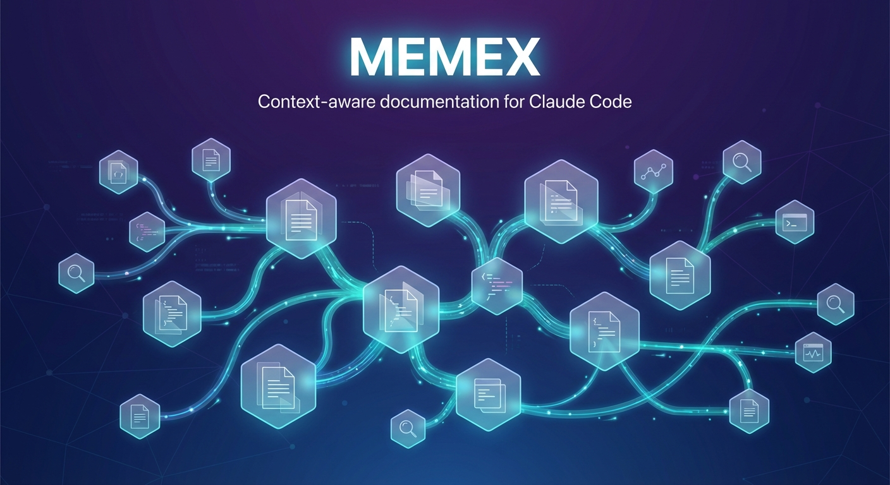

# Memex

A context-aware documentation system for Claude Code. When you ask a question, Memex automatically injects relevant documentation into the conversation based on keywords in your prompt.

Named after Vannevar Bush's 1945 concept of a "memory extender" - a device that stores and retrieves knowledge through associative trails.

## What It Does

Memex uses Claude Code hooks to:

1. **Auto-inject documentation** - When your prompt contains keywords like "database", "api", or "deploy", the matching docs get loaded into context automatically
2. **Track session state** - Shows git status and available docs when you start a session
3. **Remind about updates** - After editing a doc file, reminds you to update the glossary
4. **Archive working notes** - Cleans up temporary working documents at session end

## Installation

```bash
# Clone the repo
git clone https://github.com/johnpsasser/memex.git

# Run the installer from your project root
cd your-project
/path/to/memex/install.sh
```

The installer will:
- Create `.claude/hooks/` with all hook scripts
- Create `.claude/settings.json` with hook configuration
- Create template documentation files in `docs/`
- Set up a `docs/working/` directory for temporary notes

## How It Works

The system has four hooks that run at different points:

| Hook | When | What It Does |
|------|------|--------------|
| `session-start.sh` | Session begins | Shows git info, lists available docs |
| `context-enricher.sh` | You submit a prompt | Scans for keywords, injects matching docs |
| `validate-docs.sh` | After editing `docs/*.md` | Reminds to update GLOSSARY.md |
| `session-end.sh` | Session ends | Archives working documents |

The context-enricher hook is the key piece. It reads your prompt, looks for keywords, and wraps matching documentation in XML tags that get injected into the conversation:

```xml
<auto-loaded-documentation>
<doc path="docs/core/DATABASE.md">
...documentation content...
</doc>
</auto-loaded-documentation>
```

## Customizing Keywords

Edit `.claude/hooks/context-enricher.sh` to add your own keyword patterns:

```bash
# Add patterns for your project
case "$PROMPT_LOWER" in
    *authentication*|*login*|*oauth*|*jwt*)
        add_doc "features/AUTH.md"
        ;;
esac
```

The pattern matching is simple: if any of the keywords appear in the prompt (case-insensitive), the doc gets loaded.

## Documentation Structure

Memex works best with a tiered documentation structure:

```
your-project/
├── CLAUDE.md              # Quick reference (entry point)
├── docs/
│   ├── GLOSSARY.md        # Keyword-to-file mapping
│   ├── CONTRIBUTING.md    # How to use/update docs
│   ├── core/              # Core system docs
│   │   ├── ARCHITECTURE.md
│   │   ├── DATABASE.md
│   │   └── API.md
│   ├── features/          # Feature-specific docs
│   └── working/           # Temp files (gitignored)
└── .claude/
    ├── settings.json      # Hook configuration
    └── hooks/             # Hook scripts
```

The idea is that GLOSSARY.md is cheap to load (just keyword mappings), and the full docs only get loaded when relevant.

## The Glossary

The glossary is an index that maps keywords to documentation files. It lets Claude find relevant docs quickly without loading everything:

```markdown
### Database

- **database** -> `docs/core/DATABASE.md` - Database overview
- **schema** -> `docs/core/DATABASE.md#schema` - Table definitions
- **query** -> `docs/core/DATABASE.md#queries` - Query patterns
```

When you add new documentation, add corresponding entries to the glossary.

## Files Included

```
memex/
├── install.sh                    # 1-click installer
├── README.md                     # This file
├── .claude/
│   ├── settings.json             # Hook configuration (template)
│   └── hooks/
│       ├── session-start.sh      # Shows git info at session start
│       ├── session-end.sh        # Archives working docs
│       ├── context-enricher.sh   # Auto-injects docs (the main hook)
│       └── validate-docs.sh      # Reminder after doc edits
├── templates/
│   ├── CLAUDE.md.template        # Master reference template
│   ├── GLOSSARY.md.template      # Keyword index template
│   └── CONTRIBUTING.md.template  # Contribution guide template
└── examples/
    └── semantic-map.example.md   # Example keyword mappings
```

## Requirements

- Claude Code CLI
- bash 3.x+ (macOS default works)
- jq (for parsing hook input JSON)

Install jq if you don't have it:
```bash
# macOS
brew install jq

# Ubuntu/Debian
apt-get install jq
```

## Best Practices

### Document Size Guidelines

Keep documents small enough to load efficiently but comprehensive enough to be useful.

| Guideline | Target |
|-----------|--------|
| Maximum lines | 500 |
| Optimal range | 200-400 lines |
| Truncation threshold | 200 lines (by hook) |

When a document exceeds 500 lines, split it into sub-documents using the naming convention:

```
CATEGORY_SUBCATEGORY.md
```

Examples:
- `DATABASE_SCHEMA.md`, `DATABASE_QUERIES.md`, `DATABASE_MIGRATIONS.md`
- `AGENTS_SUPERVISOR.md`, `AGENTS_RESEARCH.md`, `AGENTS_IMPLEMENTATION.md`

### Token Efficiency

AI agents pay for every token loaded. Write docs that get to the point.

| Format | Use For | Why |
|--------|---------|-----|
| Tables | Reference data, comparisons | Scannable, compact |
| Bullet lists | Steps, options, features | Easy to parse |
| Anchor links | Cross-references | Load sections, not files |
| Code blocks | Examples, paths | Precise, copy-pasteable |

Avoid:
- Long paragraphs when a table works
- Repeating information across files
- Loading entire files when a section suffices

### Keyword Specificity

**Be specific with keywords.** Instead of matching "test" (too common), match "testing" or "jest" or "vitest".

### Anchor Links

**Use anchor links.** Point to specific sections like `DATABASE.md#schema` rather than whole files. This lets agents load only what they need.

### Incremental Growth

**Start small.** You don't need to document everything upfront. Start with CLAUDE.md and GLOSSARY.md, then add specialized docs as your project grows.

**Update the glossary as you go.** The validation hook reminds you, but get in the habit of adding keywords when you add docs.

## How This Came About

This grew out of a need to give Claude Code agents better context without blowing up the token budget. The hook system lets you selectively load documentation based on what the user is actually asking about, rather than dumping everything into the system prompt.

The original implementation was built for a project with ~15 documentation files. Without selective loading, every conversation would start with thousands of tokens of docs that might not be relevant. With Memex, the docs load on-demand based on the conversation.

## License

MIT
